#### Introduction

This article will present a machine learning problem and the concept behind solving the problem. The project will go into detail about the early exploratory steps and build a machine learning model that can be used in production to categorize data. This project is to categorize seven Rocky Mountain tree types found in the forests. In this project, we will use old legacy data from the 1990s and use modern machine learning methods to categorize the data. The owner of the data can migrate the newly categorized data over to their modern cloud database. In the late 1990s, data was collected for mapping by survey methods and done manually in the field. Though in the modern era, we can use high-resolution aerial imagery, GPS, and techniques in GIS systems to categorize cartographic data using the tools of computer vision and machine learning. However, for practical purposes, there are clients and owners of legacy data on old systems. Owners would like to migrate data from legacy systems into modern databases such as the cloud. The utilization of the data through modern computing is of use to the owners. One of the issues is how to categorize the vast amount of legacy data. Automating the categorization process with machine learning is the method proposed in this article.

A passion for outdoors and the natural environment with some previous knowledge of the domain is useful and is the reason this data was chosen for this example machine learning problem. A note about the importance of understanding the descriptions in the data and its origin, though I have professional domain experience, I still had to research the subject matter to understand the variables in the dataset fully and recommend not overlooking domain understanding. The project is about the process of working with a data source and building an algorithmic model to accomplish a workable solution to categorizing disparate data. This method can be applied to many other data sources and would produce varying degrees of success.

The process to follow is what I understand as an effective workflow as of this writing. The data background and attributes explained. I talk about feature selection and engineering. In the next section, I will show exploratory graphs to understand the data relationships better. I move into correlation, dimension reduction, partial least squares, variable importance, and final algorithm selection. There are bits of R code snippets to show how the graph or table was derived. I discuss the final model and leave with a conclusion and references. Thanks for reading! 

#### Data Background

Formerly the data is owned by Jock A. Blackard and Colorado State University with the US Forest Service Region 2. The data is being shared and open-sourced on the UCI Machine Learning Repository (2018). The dataset spans four wilderness areas in the Roosevelt National Forest. The data record is a thirty-by-thirty meter cartographic mapping cell. The cell has attributes given to it, which are what we will use in this project.

There are seven dominant tree species that we are classifying. Much of the terminology is from the survey and forestry mapping. Cell attributes: Elevation, Aspect, Slope, Distance to Water and Roads, Forest Region, etc. The variable values are in binary and integer values, and the dataset combines 40 soil types from the USGS. The dataset gives us 581,012 total observations and 54 variables to use within this project.

#### Data Attributes

Attributes are embedded metadata for GIS data files. I imported the dataset, a 79MB CSV file, into RStudio, you can see there are 581012 observations with 55 variables. The figure below is a sampling of the main variables.

| Variable Name  | Unit of Measurment |
|:---------------|:------------------:|
|Elevation |Meters              |
|Aspect    |Azimuth             |
|Slope |Degrees|
|Horizontal Distance to Hydrology |Meters|
|Vertical Distance to Hydrology |Meters|
|Horizontal Distance to Roads |Meters|
|Hill Shade at 9 am |Color Index 0 to 255|
|Hill Shade at 12 pm |Color Index 0 to 255|
|Hill Shade at 3 pm |Color Index 0 to 255|
|Horizontal Distance to Fire Points |Meters|
|Wilderness Area |Name / binary|
|Soil Types |Name / binary|
|Cover Type |1 to 7 integers|
\
```{r echo=FALSE, fig.cap="The table is from an RStudio summary of the variables contained in the Cover Type dataset and shows the first 27 columns of 55. The values are integer and binary.", error=TRUE}
knitr::include_graphics('/img/FC_1.jpg')
```

#### Roosevelt National Forest Wilderness Areas

There are four wilderness areas inside of the Roosevelt National Forest in  Colorado. There are two small areas: Neota and Cashe la Poudre and two larger areas Rawah and Comanche Peak. The aerial imagery from Google Earth helps to see how the tree density is between the barren rocky regions of the mountainous terrain. The image shows us the diversity of the environment.

| Wilderness Area | Trees/Region | Percent of Total |
|:------|:------------:|:----------------:|
|Rawah| 260,795  |44.9%|
|Comanche Peak|253,364  |43.2%|
|Cashe la Poudre|36,968  |6.4%|
|Neota| 29,884  |5.1%|
|Comanche Peak|253,364  |43.2%|
\
```{r echo=FALSE, fig.cap="The figure shows the terrain map of the location in Colorado, where the data originates. The red dots are the general location of the four wilderness areas within the Roosevelt National Forest. Image Source: https://www.google.com/maps/@40.7468344,-105.6422844,11z"}
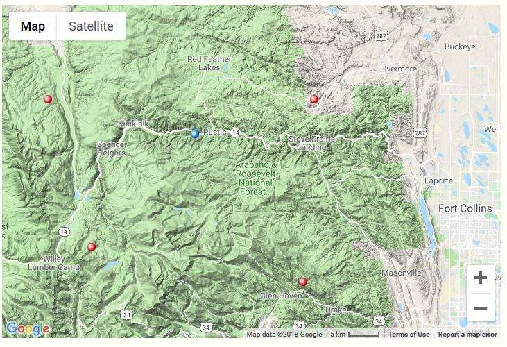
```
\
```{r echo=FALSE, fig.cap="The aerial image is from Google Earth and the colored outlines are shape files that outline the boundary of the four wilderness areas. The red lines are the forest service roads. Image Source: Google Earth Pro, Imagery data 09/07/2016"}
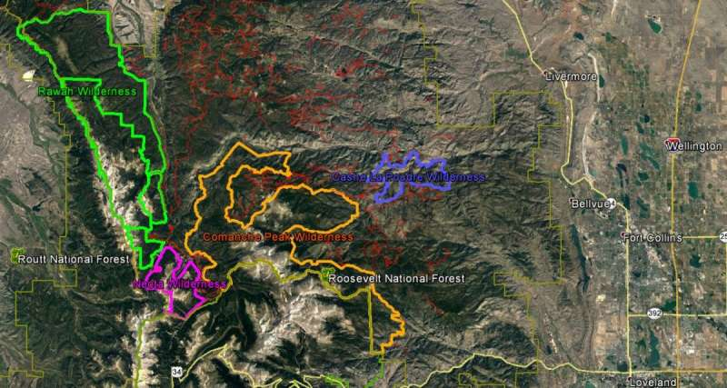
```

Below are the tree species found in the dataset and the proportions of each tree. It is important to note the sampling of each tree species because there is class imbalance. Disproportionate ratios in machine learning algorithms will not perform well and will create errors in the prediction of classes. 

#### Cover Type

`round(prop.table((table(sampleSetTran$Cover_Type))), 3) *100 # class imbalance`

| Tree Species  |Number of Samples      |  Percent of Total  |
|:--------------|:---------------------:|:------------------:|
|Lodgepole Pine |283,301 |48.4%
|Spruce/Fir |211,840 |36.5%
|Ponderosa Pine |35,754 |6.2%
|Krummholz |20,510 |3.5%
|Douglas Fir |17,367 |3.0%
|Aspen |9,492| 1.6%
|Cottonwood and Willow |2,747| 0.5%
\
```{r echo=FALSE, fig.cap="These photos are of the trees described as Cover Type in this dataset. The data describes living trees in a mountainous environment. Image Source:https://csfs.colostate.edu/colorado-trees/colorados-major-tree-species/"}
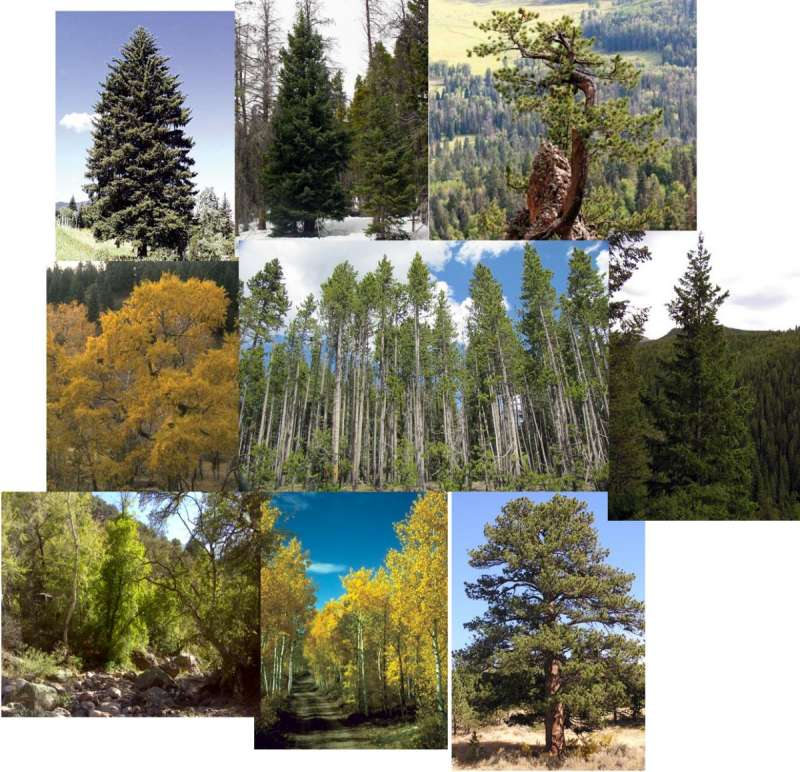
```

#### Soil Types

The table shows the 40 soil types. We can see soil type 29 is 20% of the data. Doing some research into the soil types, I can group them. I did find there are four categories of soil, but then the families there are over 20 different families. So I will leave soil types alone.

40 Soil Types:
Igneous Metaphoric
Mixed Sedimentary
Glacial
Alluvium
Families:
Cathedral, Retake, Vanet, Limber, Gothic, Bullwark, Catamount, Gateview, Leighcan,
Como, Granile, Cryaquolis, Moran, Bross, etc
(source: https://soilseries.sc.egov.usda.gov/osdlist.aspx)

| Type | Number of Samples | Percent of Total | 
|:----------|:--------:|:----:|
|Soil_Type29 |115,24   |19.8% |    
|Soil_Type23  |57,752  |9.9% |      
|Soil_Type32  |52,519  |9.0% |      
|Soil_Type33  |45,154  |7.8% |      
|Soil_Type22  |33,373  |5.7% |      
|Soil_Type10  |32,634  |5.6% |     
|Soil_Type30  |30,170  |5.2% |      
|Soil_Type12  |29,971  |5.2% |      
|Soil_Type31  |25,666  |4.4% |     
|Soil_Type24  |21,278  |3.7% |      
|Soil_Type13  |17,431  |3.0% |      
|Soil_Type38  |15,573  |2.7% |      
|Soil_Type39  |13,806  |2.4% |     
|Soil_Type11  |12,410  |2.1% |      
|Soil_Type4   |12,396  |2.1% |      
|Soil_Type20  |9,259  |1.6% |      
|Soil_Type40  |8,750  |1.5% |      
|Soil_Type2   |7,525  |1.3% |      
|Soil_Type6   |6,575  |1.1% |      
|Soil_Type3   |4,823  |0.8% |      
|Soil_Type19  |4,021  |0.7% |
|Soil_Type17  |3,422  |0.6% |
|Soil_Type1   |3,031  |0.5% |
|Soil_Type16  |2,845  |0.5% |
|Soil_Type26  |2,589  |0.4% |
|Soil_Type18  |1,899  |0.3% |
|Soil_Type35  |1,891  |0.3% |
|Soil_Type34  |1,611  |0.3% |
|Soil_Type5   |1,597  |0.3% |
|Soil_Type9   |1,147  |0.2% |
|Soil_Type27  |1,086  |0.2% |
|Soil_Type28  |946    |0.2% |
|Soil_Type21  |838    |0.1% |
|Soil_Type14  |599    |0.1% |
|Soil_Type25  |474    |0.1% |
|Soil_Type37  |298    |0.1% |
|Soil_Type8   |179    |0.0% |
|Soil_Type36  |119    |0.0% |
|Soil_Type7   |105    |0.0% |
|Soil_Type15  |3      |0.0% |

#### Feature Selection

I was looking for ways I could consolidate data and make it easier to understand the numbers. I took the elevation category and grouped that into zones. This based on mountain growth zones described by the State of Colorado. Tree species grow in a range of elevations in the rocky mountains, and I wanted to show that here hoping it would help me with my visualization. 

Elevations – Mountain Growth Zones (Alpine, Subalpine, Montane, Foothills)

```{r echo=FALSE, fig.cap="This graphic describes the ecosystems or growth zones relative to elevation above sea level in Colorado. Image source: https://static.colostate.edu/client-files/csfs/pdfs/894651_08FrstHlth_www.pdf"}
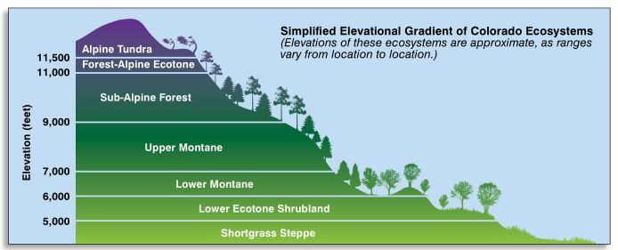
```


```{r echo=FALSE, fig.cap="A similar graphic as above, this describes the life zones or growth zones in Colorado relative to a specified range of elevations that are described by Foothills, Montane, Subalpine, and Alpine. Feature engineering helped to group the elevation variable for exploring the data relationships. Image source: https://static.colostate.edu/client-files/csfs/pdfs/894651_08FrstHlth_www.pdf"}
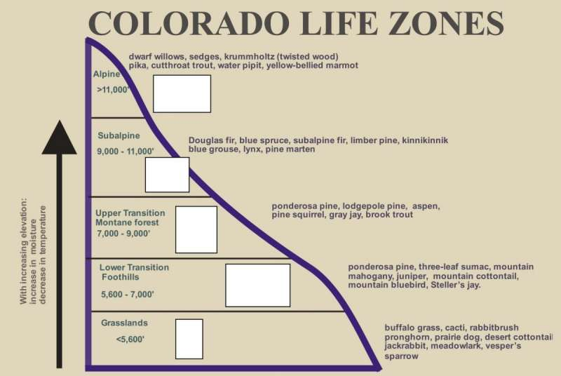
```

I also took the aspect category and broke that down into eight compass directions. The aspect is the direction that the mountain is facing. The aspect can be an indicator of the amount of sunlight or temperature the tree species would utilize for growth. 

```{r echo=FALSE, fig.cap="The two charts show the aspect of azimuth degrees used in the dataset. Feature Engineering is applied to group aspects into nine compass directions and used for exploring the data relationships. Image source: https://desktop.arcgis.com/en/arcmap/10.3/tools/spatial-analyst-toolbox/how-aspect-works.htm", fig.show='hold'}
knitr::include_graphics(c("../../static/img/FC_8.jpg","../../static/img/FC_7.jpg"))
```

#### Feature Engineering

There are two variables, one is the horizontal distance to water, and the other is the vertical distance to water. I thought I could just consolidate the two using the Pythagorean theorem to calculate the “distance-to-water" That would give me a surface distance. It would correlate with the elevation and the vertical distance otherwise. 

New Variable:  
Distance-to-Water = c   
horizontal distance to hydrology = b  
vertical distance to hydrology = a  

```{r echo=FALSE, fig.cap="The Pythagorean Theorem is used to calculate a new variable distance-to-water which will give a general surface distance and eliminate the conflict between elevation and vertical-distance-to-water variable"}

```

Created categorical groups to visualize the data:
Cover Type Predictor Variable 
Descriptive labels

- Spruce & Fir 
- Lodgepole 
- Ponderosa 
- Cottonwood & Willow 
- Aspen 
- Douglas Fir
- Krummholz

Aspect Variable
Labeled as the 8 Compass Directions

- North 
- Northeast 
- East 
- Southeast 
- South
- Southwest
- West 
- Northwest

#### Exploratory Graphs

This section reviews plots of the dataset and makes comparisions of data variables.

```
ggplot(smlSet, aes(Cover_Type, Elevation)) + 
  geom_boxplot(aes(color = Cover_Type), 
  outlier.color = "black") + 
  ggtitle("Cover Type and Elevation")
```

```{r echo=FALSE, fig.cap="The boxplot visually describes the relationship between Elevation (in meters) and Cover Type. There is a clear pattern between cover type and elevation. Outliers are indicated and noted."}
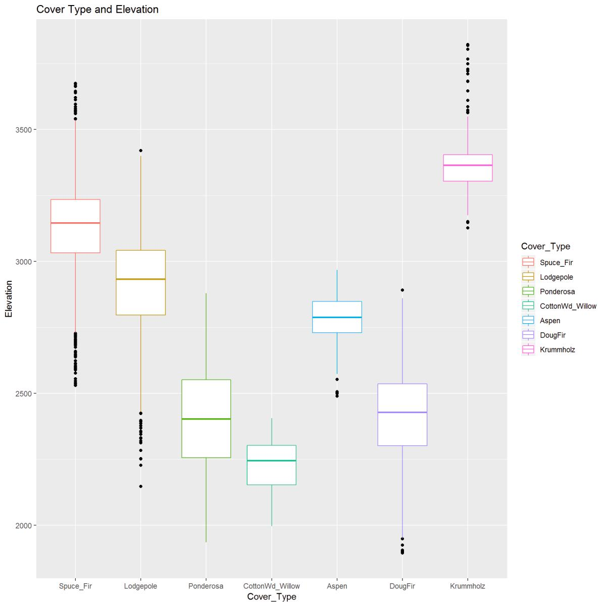
```
\

```{r echo=FALSE, fig.cap="The barplot describes the cover type’s in the four wilderness areas. Lodgepole is found in all 4 Wilderness Areas while Cottonwood is only found in Wilderness Area 4. The 2nd figure shows the proportioned areas containing cover types.", fig.show='hold'}
knitr::include_graphics(c("../../static/img/FC_10_1.jpg","../../static/img/FC_10_2.jpg"))
```
\
```{r echo=FALSE, fig.align='left', fig.cap="This graph describes the aspect or newly created variable ‘Direction’ to the cover type. There appears to be some significance where trees are concerning the sun.", fig.show='hold'}
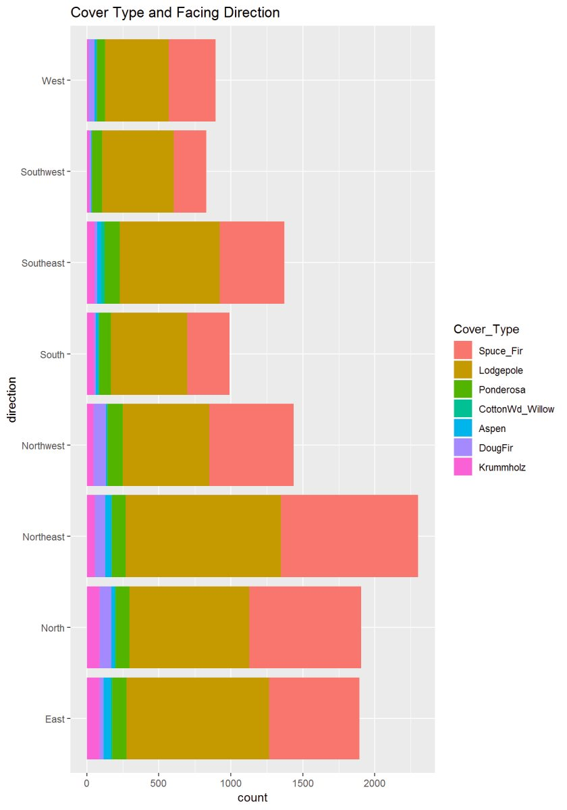
```
\
```{r echo=FALSE, fig.align='left', fig.cap="In this figure, Wilderness Area and Direction show the relationships. We can see in Wilderness Area 1 a strong East to Northeast while Wilderness Area 3 has strong North and Northeast directions.", fig.show='hold'}
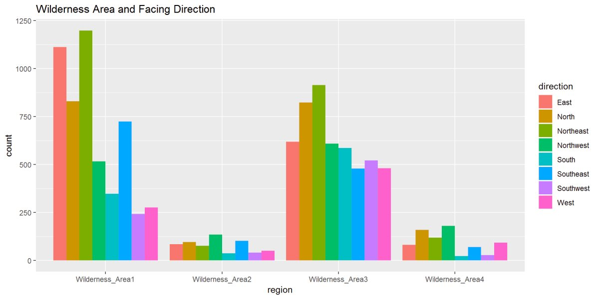
```
\
```{r echo=FALSE, fig.align='left', fig.cap="This figure shows the relationship between cover type and the slope of the terrain. There are patterns and possibly some outliers at the steepest slopes 40 to 50+ degrees.", fig.show='hold'}
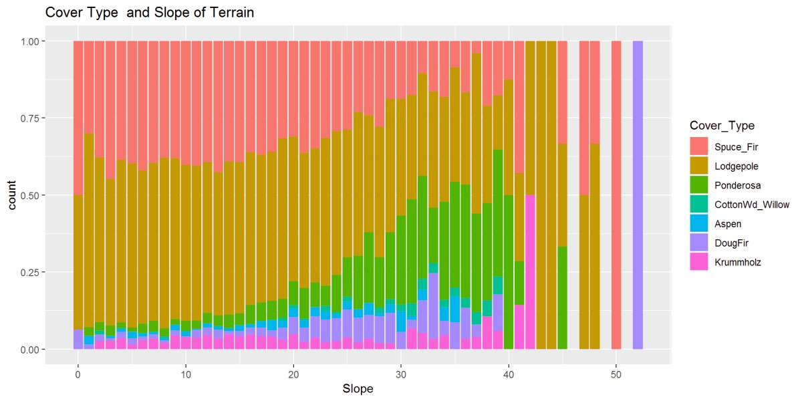
```
\
```{r echo=FALSE, fig.cap="This figure describes the cover type to soil type. A clear pattern and shows Soil Type 29 holding two cover types in the majority, however, found growing in many other soil types.", fig.show='hold'}
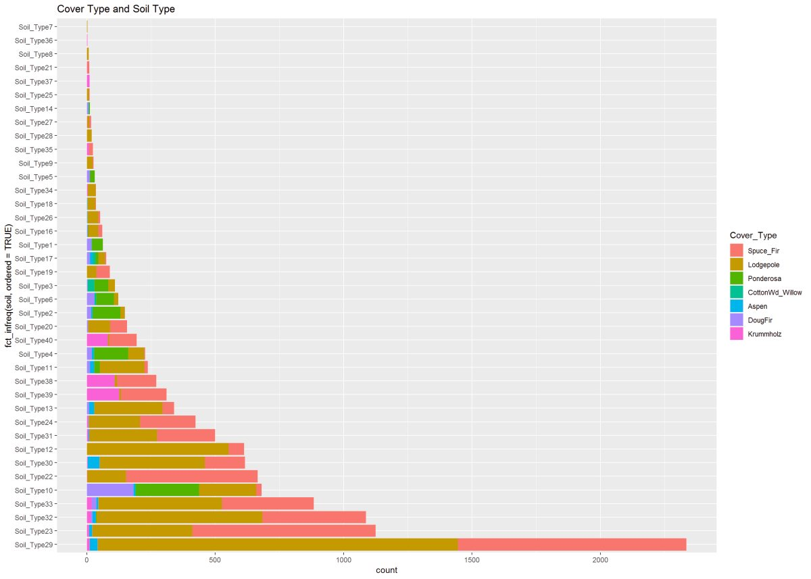
```
\
```{r echo=FALSE, fig.cap="These two graphs are showing the Soil Types to the Wilderness Area and Growth Zone. Soil Type 29 is predominant in Wilderness Area 1 and 3. On a different note, The soil type 29 shown in the second chart in the Montane and Subalpine elevations and Alpine has a small clustering of soil types shared with Subalpine.", fig.show='hold'}
knitr::include_graphics(c("../../static/img/FC_10_7.jpg","../../static/img/FC_10_8.jpg"))
```
\
```{r echo=FALSE, fig.align='left', fig.cap="This graph has the cover type, aspect, and distance to water variables and gives the data some movement. The Krummholz stands out and is further from the water; the cottonwood stays close to the water and moves further as the aspect changes closer to the South.", fig.show='hold'}
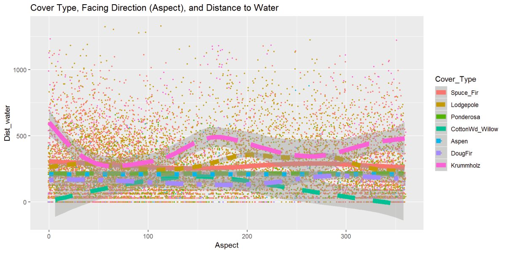
```
\
```{r echo=FALSE, fig.align='left', fig.cap=" Cover type, slope, and elevation relationship are displayed above. A strong clustering from 0 to 20 degrees. Most cover types hold at steady elevations as seen in earlier graphs, and here we can see the same, however as the slope increases, there is the movement of some tree types to lower elevations. Ponderosa Pine and Douglas Fir trend to lower elevations as the slope gets steeper. DougFir does a climb up at steeper slopes, and we saw this in the outliers in the boxplot figure.", fig.show='hold'}
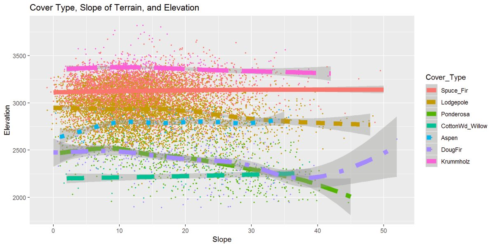
```
\
```{r echo=FALSE, fig.align='left', fig.cap="This figure is the cover type, elevation, and aspect or facing direction. Most trees are steady, but Ponderosa and Cottonwood like the Southern exposures a bit more as the elevation go up. Most ever slightly climb in the middle while the Krummholz dips.", fig.show='hold'}
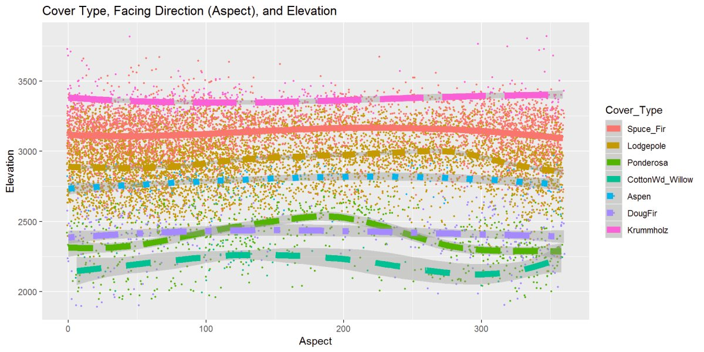
```
\
```{r echo=FALSE, fig.align='left', fig.cap="This figure describes the relationship between cover type, elevation, and distance to water. There is a clear distinction the bottom 3 Cottonwood, Douglas Fir, and Ponderosa don't exist outside of the 600-700m to water range with Aspen following around 800m to water. The Lodgepole Pine, Spruce, and Krummholz reach further away from water. Given this is standing or moving water sources and not accounting for snow or rainfall", fig.show='hold'}
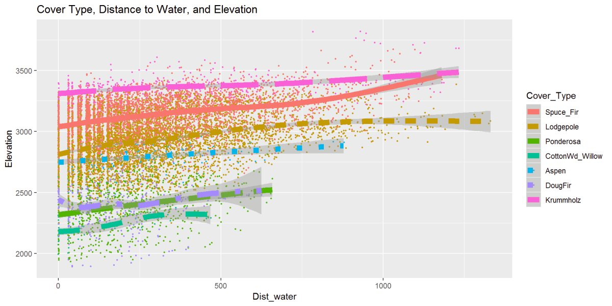
```
\
```{r echo=FALSE, fig.align='left', fig.cap="One last exploration figure looks at cover type, distance to water, and aspect or facing direction. The trees are grouped tightly in the middle of the aspect range, which is a Southerly facing direction. Same relationship as the previous distance to water. Lodgepole stands out and moving further from the water and facing direction more East to Northeasterly, seen earlier.", fig.show='hold'}
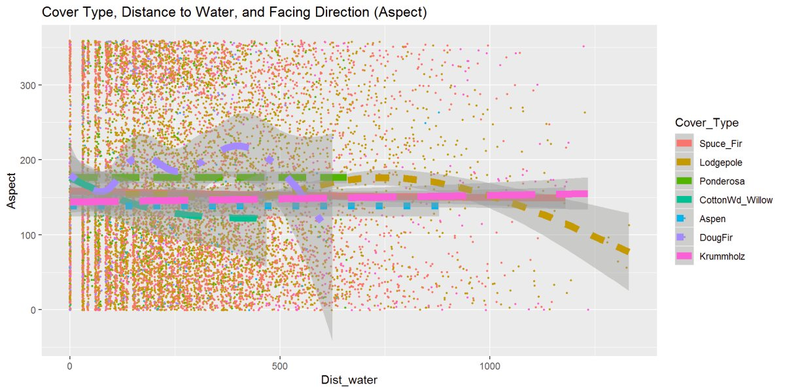
```

#### Correlation

I started the statistical analysis with a correlation plot. I have taken a smaller sampling of the data, it’s a smaller randomized sample representative of all the data because of limited computational resources in my environment and then able to create the correlation matrix. Here are several variables that are correlated. Assuming that removing some of these variables can simplify this, I’ve removed the zero or near-zero variance predictors to see what the correlation does. This technique is debatable, but removing some of the binary 0s from the soil types will help to clean this data up where variables have very few unique values.

`corrplot::corrplot(cor1, method = "square")`

```{r echo=FALSE, fig.cap="The correlation matrix shows clear upper and lower confidence intervals (red/blue squares) clusters"}
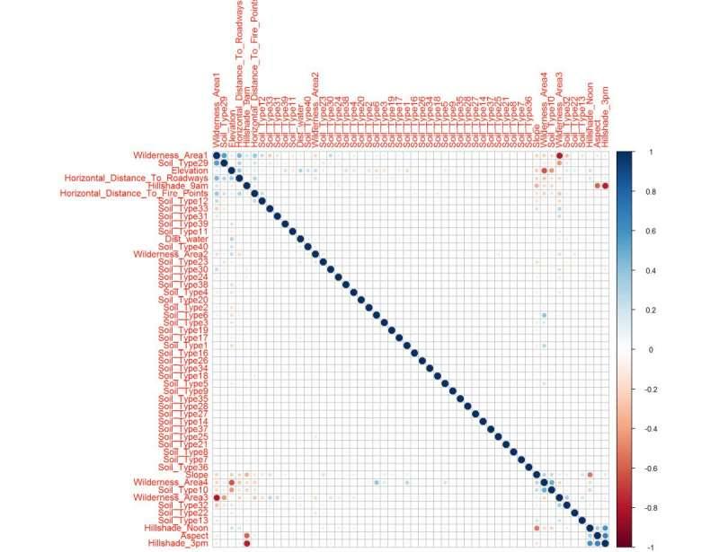
```


Hierarchical clustering order “hcluster” correlation plot
It shows the areas of correlation in clusters groupings.

`corrplot::corrplot(cor1, order = "hclust") # Clusters Correlations`

```{r echo=FALSE, fig.cap="This correlation matrix uses the hierarchical clustering ordering method setting because the previous figure indicated some clustering, here we magnify that trait to understand what variables are connected. Soil Type 29, Aspect, Slope, and Elevation. Noted is the distance to water is not heavily correlated, which can be good for my variable selection later."}
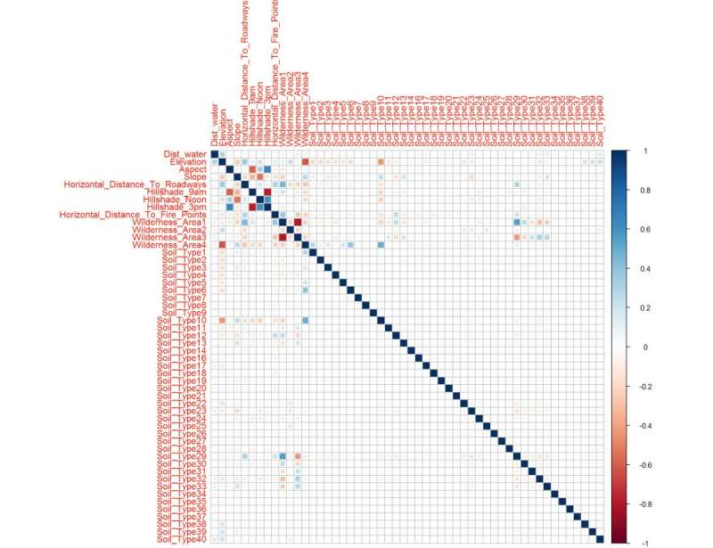
```

After performing a near or at zero variance and shows the most correlated predictors Hillshade and Aspect standout. Here is a reduced dataset, and it also shows you how each variable is importantly related.

`nzv <- nearZeroVar(sampleSet, saveMetrics= TRUE) # caret package`

```{r echo=FALSE, fig.cap="Correlation Matrix after near or at zero variance adjustment and cleans up the two previous correlation plots to show the confidence intervals that will likely make up the important variables in the trained model. The correlation plot reflects what was see in the previous figures."}
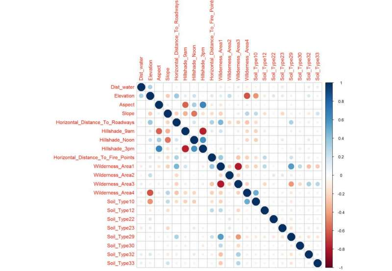
```

#### Dimension Reduction

**Partial Least Squares**

Another way to reduce dimensions is the Partial Least Squares Regression. The optimal number of principal components needed based on the R2. R2 is on the low or “weak” end between 0 and 1 at R2 = 0.32. Continuing with the partial least squares, I’ve created this plot of the root mean standard error of prediction and predicts using the test data.

```
fit1 <- plsr(Cover_Type~., 
            data=sampleSet2pls, 
            Scale=TRUE, 
            validation ="CV"
)
validationplot(fit1, val.type = "R2") # plots optimal number of components Based on R^2
```

```{r echo=FALSE, fig.cap="R2"}
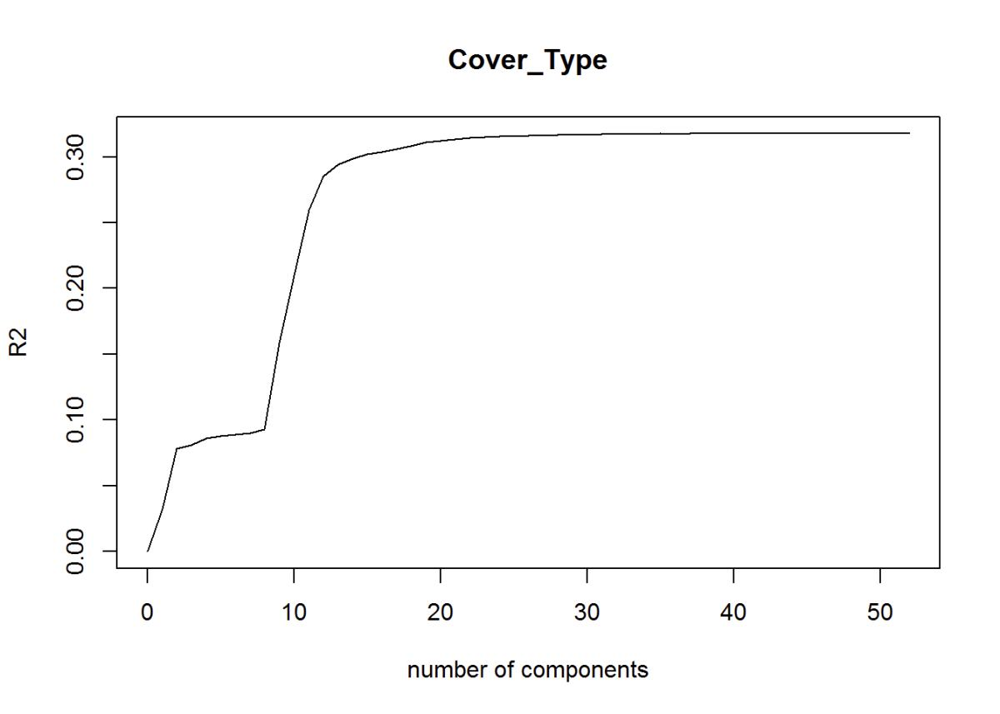
```

Root-Mean-Standard Error of Prediction Shows the ideal number of components around 40. RMSEP explains both predictor and response variance. Here we can identify 40 variables or parts that are important for modeling.

```
pls.RMSEP <- RMSEP(fit1, estimate="CV")
plot(pls.RMSEP, 
    main="RMSEP PLS Cover_Type", 
    xlab="Components"
)
min_comp <- which.min(pls.RMSEP$val)
points(min_comp, 
      min(pls.RMSEP$val), 
      pch=1, col="red", 
      cex=2) # Show number of components in the graph
```

```{r echo=FALSE, fig.cap="Root Mean Square Error of Prediction"}
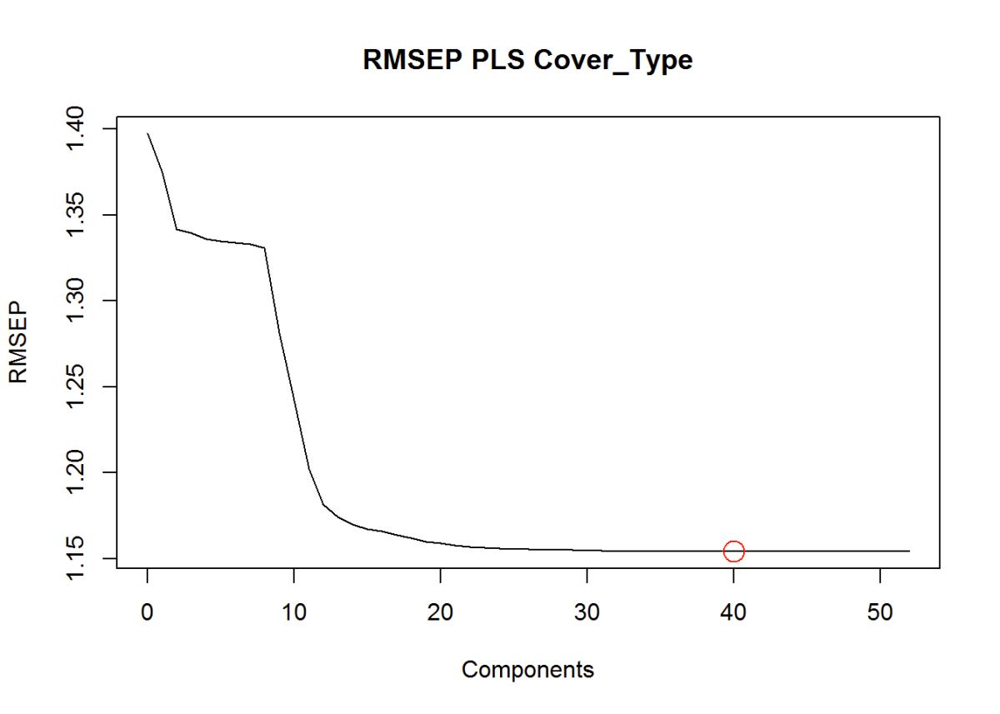
```

This plot is the partial least squares variable importance plot to each species. This way is better than just using the correlation matrix because it takes into account each tree species.  
 
In this plot of partial squares, I can show that the dependent variables and how they relate to the predictor variables. You usually can't see this in a correlation plot, so this is very interesting to see. It helps to narrow down which variables to use.

```
plsFit <- train(Cover_Type~., 
                data = train, 
                method = "pls", 
                preProc = c("center", "scale"),
                tuneLength =40,
                trControl = ctrl, 
                metric = "ROC") 

plot(varImp(plsFit), top =40)
```

```{r echo=FALSE, fig.cap="PLS - Variable Importance"}
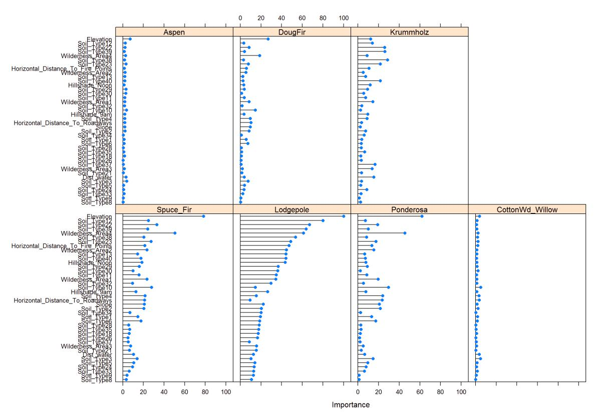
```

One last partial least squares plot, and it shows the optimized number of variables that I should be looking for in the model. It levels out around 36 variables and is what I should use as an optimal number of variables.

`ggplot(plsFit)  + ggtitle("Optimizing the Number of Variables")`

```{r echo=FALSE, fig.cap="PLS - Variable Importance shows the optimized number of variables around 36."}
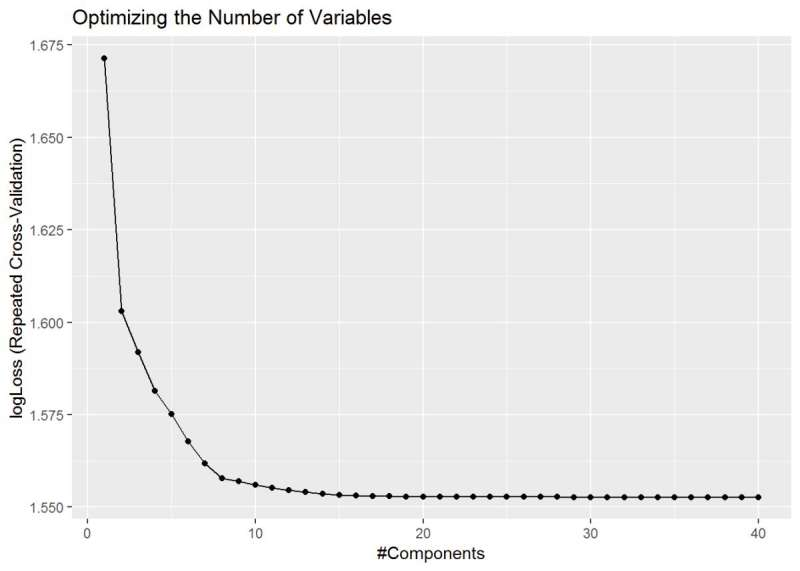
```
 
**Variable Importance**

I wanted to test another method of determining the optimal number of variables to use. Here the random forest was used to determine the most important variables. Used 10-fold cross-validation with 80% accuracy and a kappa of 68%

I wanted to compare the results from partial squares to using the random forest variable importance graph. I like this one because it gives me an idea of the model accuracy in the Kappa and it also spells out each variable and giving a weight value to them with this graph on the right we can see which variables I’m going to use in my models.

```
mdl <- train(Cover_Type~., 
             data = train, 
             method = "rf", 
             preProcess = c("center", "scale"), 
             trControl = ctrl2)
             
importance <- varImp(mdl, scale=FALSE)

ggplot(importance)  + ggtitle("Top Variable Importance")
```

```{r echo=FALSE, fig.cap="Random Forest Variable Importance and overall values.", fig.show='hold'}
knitr::include_graphics(c("../../static/img/FC_19.jpg", "../../static/img/FC_18.jpg"))
```

Uses a feature selector package, the scatter plot is of the weights on the importance index. Like the plot above, elevation is a top variable. There is a grouping of approx. Eight above 40.

```
weights <- random.forest.importance(Cover_Type ~., 
                                    train, 
                                    importance.type = 1
)
plot(weights$attr_importance)
```

```{r echo=FALSE, fig.cap="Random Forest Feature Selection and the attribute importance index values.", fig.show='hold'}
knitr::include_graphics(c("../../static/img/FC_20.jpg","../../static/img/FC_21.jpg"))
```

#### Algorithm Selection

I decided to run an ensemble method first. It will give me weighted averages and indicate the best model to use. The algorithms used in this are glmnet, random forest, ranger, xgboost, neuralnet, support vector, and a few others. The Super Learner package has a built-in predictor function and returns the values based on the validation data. The Super Learner provides wrapper functions for these algorithms and allows me to move quickly through testing these, and weight and fit for each algorithm are estimated. I get a Risk and Coefficient function

```
sl_model <- c("SL.mean",
              "SL.glmnet", 
              "SL.randomForest", 
              "SL.ranger",
              "SL.xgboost", 
              "SL.nnet", 
              "SL.ksvm",
              "SL.svm",
              "SL.nnls") # mean is lowest benchmark

sl <- SuperLearner(Y=Y_train, 
                  X=X_train, 
                  family = gaussian(), 
                  SL.library = sl_model
)
```
                   
```{r echo=FALSE, fig.align='left', fig.cap="Shows the Risk and Coefficient of Error for each of the models. Ranger has the best result."}
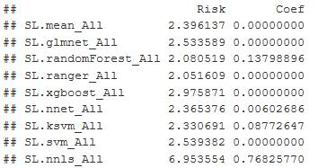
```

I found the Super Learner -Ranger produced the best results, and is a version of random forest that runs much faster and suited for high dimension datasets. The lowest risk coefficient is what I am looking for in the output and ranger/random forest have it.

```
r = CV.SuperLearner(Y=Y_train, 
                    X=X_train, 
                    family = gaussian(), 
                    V=10, 
                    SL.library = sl_model
)

summary(r) 

plot(r) + theme_bw() + ggtitle("Model Preformance Estimate") # plots Crossfold Validation
```

```{r echo=FALSE, fig.cap="Super Learner function wrapper output for the various models. Risk is based on the Mean Squared Error (MSE)", fig.show='hold'}
knitr::include_graphics(c("../../static/img/FC_22.jpg","../../static/img/FC_23A.jpg"))
```

```
pred <- predict(sl, 
                X_hold, 
                onlySL = T
)
head(pred$pred)

qplot(pred$pred[, 1], 
      binwidth=0.001) + 
      theme_linedraw() + 
      ggtitle("Prediction Metric"
)
```

```{r echo=FALSE, fig.align='left', fig.cap="This figure shows the prediction back on the test data, pulls the metric form inside the model"}
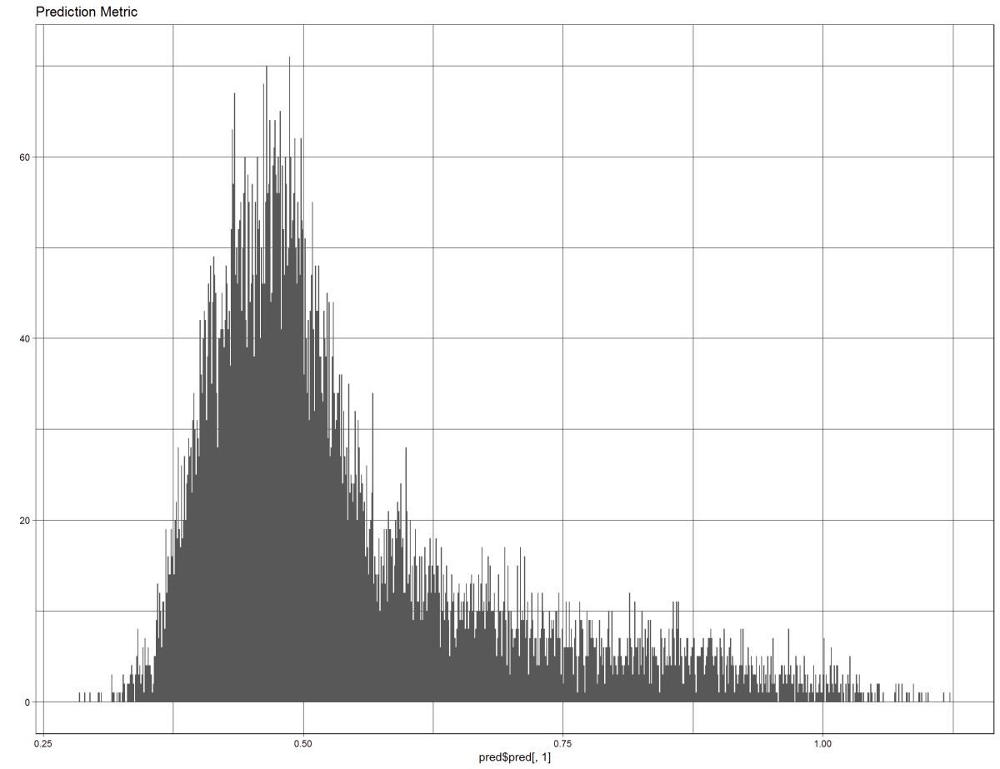
```

Next is using the random forest from the caret package. The reason is the processing time for other modeling techniques. It still took too much time to run, and we are still figuring out what models and parameters to use. 

After the super learner, I went back to the random forest in the cart package. Here is the output from the predictors, and it shows you the number of optimal M tries, 24 at 80% accuracy and a Kappa of 67.3%

```
control <- trainControl(method='repeatedcv', 
                        number=10, 
                        repeats=3,
                        search = 'random'
)
rf_random <- train(Cover_Type~.,
                   data = training,
                   method = 'rf',
                   metric = 'Accuracy',
                   tuneLength  = 15, 
                   trControl = control
)
```   
             
```{r echo=FALSE, fig.cap="10-Fold Cross Validation output graph Mtry optimal at 24. 80% Accuracy and Kappa at 0.67.", fig.show='hold'}
knitr::include_graphics(c("../../static/img/FC_25.jpg","../../static/img/FC_26.jpg"))
```

Random Forest out of the box (OOB) method. The tuning function and outputs 19 with the lowest error.

```
bestMtry <- tuneRF(training[,-1],training[,1],
                   mtryStart= 2,
                   stepFactor = 1.5, 
                   improve = 1e-5, 
                   ntree = 500
)
```

```{r echo=FALSE, fig.cap="Random Forest out of the box (OOB) method. A tuning function and outputs 19 Mtry as optimal with the lowest error", fig.show='hold'}
knitr::include_graphics(c("../../static/img/FC_27.jpg","../../static/img/FC_28.jpg"))
```

A large chunk of time to run this model. The initial run was on fewer trees and discovered more was better. 3000 to 5000 trees produced better results. It took a while to run, but I was able to come up with a better value to enter into my final model.

```
for (ntree in c(1000,2000,3000,4000,5000)){
  set.seed(17)
  fit <- train(Cover_Type~.,
               data = training,
               method = 'rf',
               metric = 'Accuracy',
               tuneGrid = tunegrid,
               trControl = control,
               ntree = ntree
)
  key <- toString(ntree)
  modellist[[key]] <- fit
}

results <- caret::resamples(modellist)

lattice::dotplot(results)
```

```{r echo=FALSE, fig.cap="Accuracy and Kappa metric graph comparing 1000 to 5000 trees in the tuning parameter of the random forest model. The table gives the values and shows the values of accuracy and Kappa.", fig.show='hold'}
knitr::include_graphics(c("../../static/img/FC_29.jpg","../../static/img/FC_30.jpg"))
```

#### Final Model

The Ranger random forest algorithm from the Super Learner package in R was performing better than the random forest from the caret package. For all of the previous work, parallel processing is used, and Ranger random forest algorithm does run faster even though it’s still 30 min training time. The model run was the best yet with all the models. I was holding at 81% accuracy and a Kappa of 70%. Mtry of 39 using the extra trees, 3000 trees and I up sampled the training dataset because of the low proportions, this made a nice increase in the accuracy.
 
Before I came up with my final model, it's worth noting I ran the Ranger package quite a few times, and I was adjusting the scaling centering normalization of the data and also trying different parameters. This model is the one that came up the best. I used Mtry of 39 in a split rule using the extra trees. The number of trees seems to be around 3000. As optimal. They train the model, and I came up with an 81% accuracy in a Kappa of 70%

I thought that was pretty good. That was the highest result training that I had come up with after multiple tests and iterations. It's worth mentioning, though, that I addressed the disproportion of the data and tried up sampling and down sampling methods, and this uses the up sampling method. Which I can use with preprocessing in the caret package. So here you have to give credit to the up sample method.

```
tuneGrid <- expand.grid(.mtry = 39,
                        .splitrule = "extratrees",
                        .min.node.size = 1
)
set.seed(201)                     
rf_final <- train(Cover_Type~., 
                  data = training,
                  method = "ranger",
                  tuneGrid = tuneGrid,
                  num.trees = 3000,
                  trControl = fit_control
)
```

```{r echo=FALSE, fig.align='left', fig.cap="Random Forest Model Tuning Grid"}
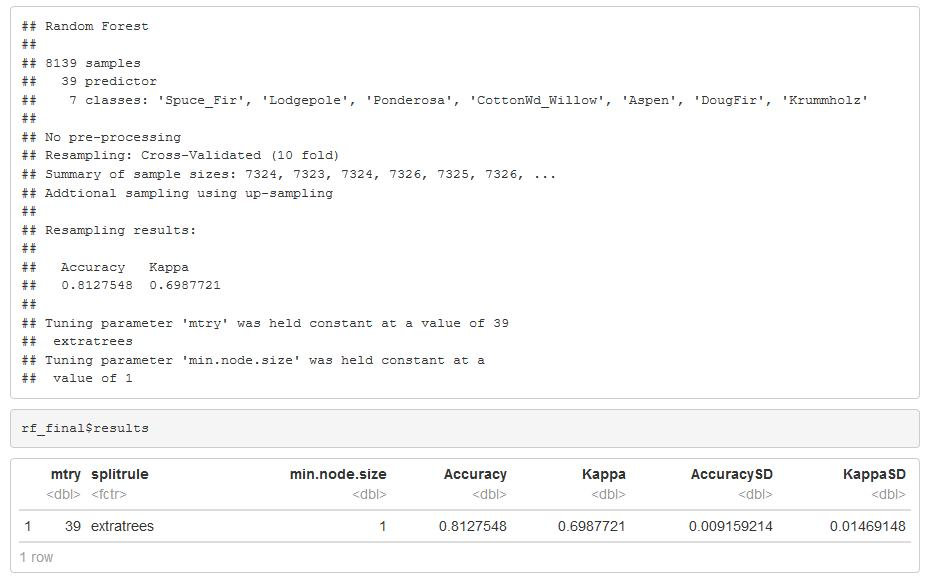
```
The final prediction and a selected model. I was able to get an 82% accuracy rate with a Kappa of 71%. There are some false positives and false negatives, mainly with spruce and Lodgepole pine. So there's some room for improvement. Which classes did better? Ponderosa is 90% balanced accuracy. Aspen is the lowest at 72%. 

This graph shows us the statistics by class. It is interesting to see that between all seven classes where the balanced accuracy was for each one. It is good to see that the Ponderosa had a 90% balance accuracy while two other categories three others were in the 80 percentile. The Aspen and Cottonwood were in the low 70 percentile, and those categories were also some of the lower proportioned samples that I had in the data. It makes me think that I can improve this model or improve doing an ensemble method where I can narrow down each of these classes individually. And have them predict cumulatively in an ensemble method. So there’s room for improvement here.

- Accuracy = 82%
- Kappa = 71%
- The Spruce_Fir False Positive 
- The Lodgepole False Negative

```
final_pred <- predict(rf_final, testing)
caret::confusionMatrix(final_pred, testing$Cover_Type)
```

```{r echo=FALSE, fig.align='left', fig.cap="Random Forest Model Results "}
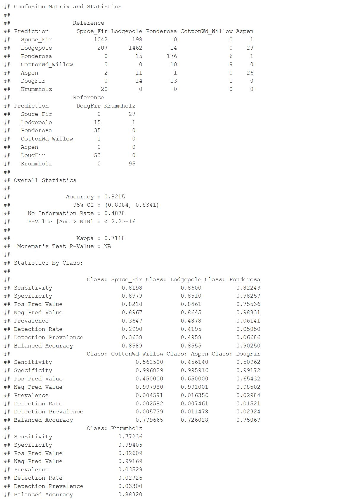
```

#### Conclusion

This project was a comprehensive analysis starting with coming up with an idea to a final model and took about eight weeks to get to this point. While still calculating somewhat accurately, there was a lot of trial and error in this project with weeks of failure. The original data set was too big to run locally. I wasn’t able to run some of the algorithms in training. But I did discover that I can use multiple cores to process. A smaller sample set was used and still took 30-45min to run each training model. In the beginning, it took several weeks of experimenting using the individual model libraries until the discovery of the Caret package that has all of the algorithms available AND can use multiple cores to process. In my case, I ran 6-7 cores with 32GB RAM. I used the ranger package, which is a random forest model. It is just leaner, and it runs larger data more efficiently.

The analysis started with looking at the exploratory graphs, and there were some important relationships between the variables. Then a correlation matrix was used to see if the coefficients between variables showed me associations not so prominent and to summarize the data. I found some variable dependencies that need to be changed. From the information gathered, I performed feature engineering on a few variables to reduce the dependencies. My next goal was to use methods to find variable importance and reduce the dimensions of the dataset down to meaningful relationships. I applied the partial least squares technique to find predictor variables that are uncorrelated, a good practice to reduce the collinear relationships seen in the correlation matrix. I decided to try another method and used the random forest to determine variable importance because I had a lot of variables, and this technique has gained popularity due to its benefits. I used the list of the top variables to create the final training and testing dataset. These findings showed up in the initial exploratory graphs. I found a wrapper package that gave me a choice of machine learning algorithms to test them all in an ensemble to determine which algorithm would be best for classifying the data. It returned the random forest algorithm. The Ranger is a function that produces a faster version of the random forest algorithm. When I got to this point as previously indicated, I implemented multi-core processing to speed the time on training the models. Ranger did make it easier. I didn’t have much time to play around with the parameters; however, I tested several parameters to optimize the random forest model. All the work and eight weeks, I was able to build a model and reduce the dimensions of the data to produce an 82% accuracy with a Kappa of 71%. This result would work for the task we set out to do to classify data points—definitely room for growth.

#### References

ArcGis.com (2018). How Aspect works. Retrieved from: http://desktop.arcgis.com/en/arcmap/10.3/tools/spatial-analyst-toolbox/how-aspect-works.htm

ArcGis.com (2018). Colorado Life Zones. Retrieved from: https://www.arcgis.com/home/item.html?id=df93467a99f24d95948e6fd37bb77303#overview

ArcGis.com (2018). Slope. Retrieved from: http://desktop.arcgis.com/en/arcmap/10.3/tools/spatial-analyst-toolbox/slope.htm

ArcGis.com (2018). Hillshade. Retrieved from: http://desktop.arcgis.com/en/arcmap/10.3/tools/spatial-analyst-toolbox/hillshade.htm

Bali, R., Sarkar, D., Lantz, B., & Lesmeister, C. (2016). R: Unleash Machine Learning Techniques. Packt Publishing Ltd.

Chou, Y. W. (2015). Machine learning with R cookbook.

City of Fort Collins. (n.d.). Natural Areas Program. Retrieved from: https://www.fcgov.com/naturalareas/mn-res-pdf/lifezones2014.pdf

Colorado State Forest Service. (n.d.) Five-Year Strategic Plan. Retrieved from: https://csfs.colostate.edu/media/sites/22/2014/02/CSFS-StrategicPlan-2016-2020.pdf

Colorado State Forest Service. (n.d.) Colorado’s Major Tree Species. Retrieved from: https://csfs.colostate.edu/colorado-trees/colorados-major-tree-species/#1466528536401-3dfe36cb-d417

Firescape. (2018). Rocky mountain Montane Riparian. Retrieved from: https://www.azfirescape.org/galiuro/ecosystem-description/rocky-mountain-montane-riparian

Google (2018). Importing Geographic Information Systems (GIS) data in Google Earth. Retrieved from: https://www.google.com/earth/outreach/learn/importing-geographic-information-systems-gis-data-in-google-earth/#importtiff

Kuhn, M., & Johnson, K. (2013). Applied predictive modeling (Vol. 26). New York: Springer.

Kuhn, M. (2018). The caret Package. Retrieved from: https://topepo.github.io/caret/index.html

Olsen, B. (2010). Lodge-Pole Pine Forest. Retrieved from: https://www.flickr.com/photos/bryanto/4722902786

State of Colorado. (2008). 2008 Report, The Health of Colorado’s Forests. Retrieved from: https://static.colostate.edu/client-files/csfs/pdfs/894651_08FrstHlth_www.pdf

UCI Machine Learning Repository. (2018). Covertype Data Set. Retrieved from : https://archive.ics.uci.edu/ml/datasets/covertype

USDA Forest Service. (2018). FSGeodata Clearinghouse. Retrieved from: https://data.fs.usda.gov/geodata/

USDA Natural Resources Conservation Service. (2018). Soil Series Descriptions. Retrieved from: https://soilseries.sc.egov.usda.gov/osdlist.aspx

Wickham, H. (2016). ggplot2: elegant graphics for data analysis. Springer.

Wickham, H., & Grolemund, G. (2016). R for data science: import, tidy, transform, visualize, and model data. O'Reilly Media, Inc.

